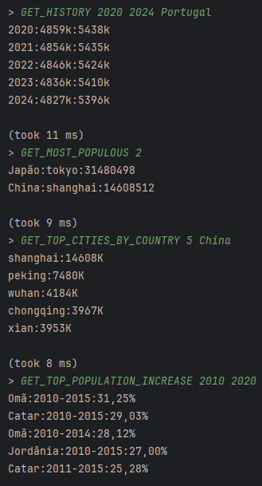
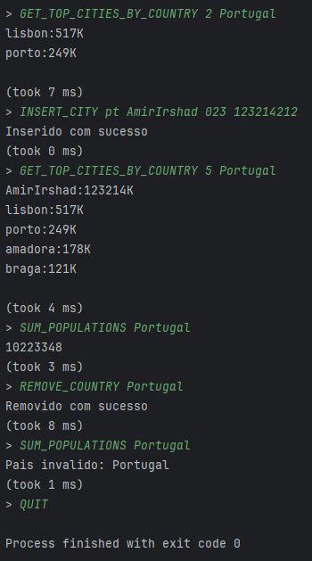

# World Meter - Java

This project was developed as part of the Algorithms and Data Structures course during the second semester of my BSc degree. It allows performing various queries about countries, cities, and population data. The project focuses on implementing data structures that provide efficient search, insertion, deletion, and data processing operations.

The program utilizes `.csv` files for data regarding countries, cities, and populations. It also includes unit tests (test-files) to ensure the correctness and reliability of the operations and data manipulations.

PS: If you want to use the program with the original files, you must change the folder name to - "test-files".

## Commands List

- COUNT_CITIES - Counts the number of cities with a population greater than or equal to a specified number.
- GET_CITIES_BY_COUNTRY - Lists the first cities of a specified country in the order they appear in the file.
- SUM_POPULATIONS - Calculates the total population of a list of countries.
- GET_HISTORY - Shows the male and female population of a specified country over a given range of years.
- GET_MISSING_HISTORY - Displays the countries that are missing data for certain years within a specified range.
- GET_MOST_POPULOUS - Lists the most populous cities worldwide in descending order.
- GET_TOP_CITIES_BY_COUNTRY - Lists the most populous cities for a specified country.
- GET_DUPLICATE_CITIES - Displays duplicate cities without showing the original, filtered by a minimum population.
- GET_COUNTRIES_GENDER_GAP - Shows the discrepancy between the male and female population for countries exceeding a specified gender gap.
- GET_TOP_POPULATION_INCREASE - Shows the population increase within a specified range of years.
- GET_DUPLICATE_CITIES_DIFFERENT_COUNTRIES - Displays duplicate city names across different countries, filtered by a minimum population.
- GET_CITIES_AT_DISTANCE - Lists cities within a specified distance in a given country.
- GET_CITIES_AT_DISTANCE2 - Lists cities within a specified distance in one country and another distance in another country.
- GET_CITIES_WITHIN_RADIUS - Displays cities within a certain radius of another city.
- INSERT_CITY - Inserts a new city into the data structure.
- REMOVE_COUNTRY - Removes a specified country and updates the list of cities.

## Program Examples

    
    
<em>Commands exemple</em>

## Insert and Remove Examples

    
    
<em>Insert and remove exemple</em>

## Author

- <a href="https://github.com/amirajij" target="_blank">Amir Irshad</a>
- <a href="https://amirajij.github.io/" target="_blank">Personal Website</a>
